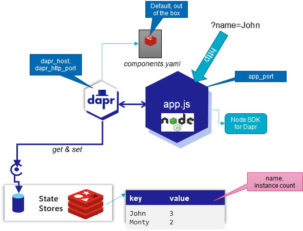
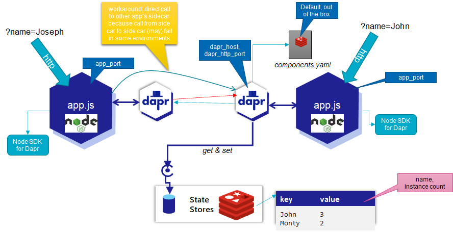
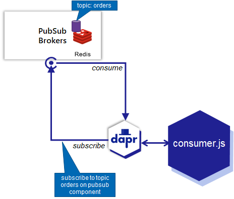
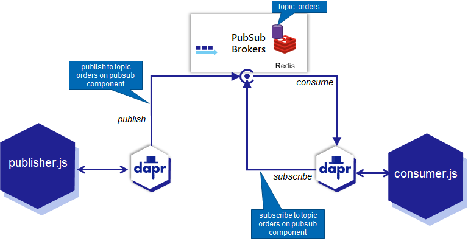
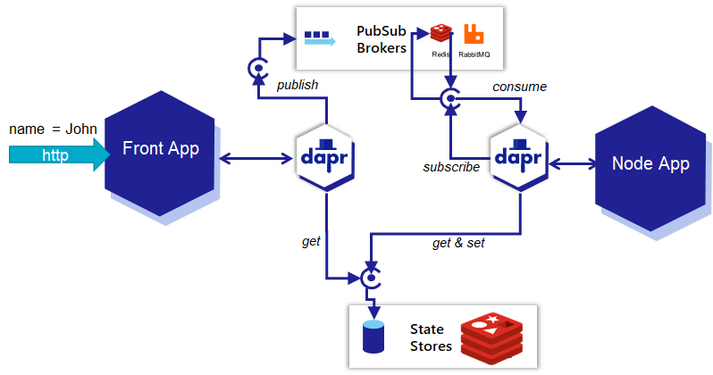
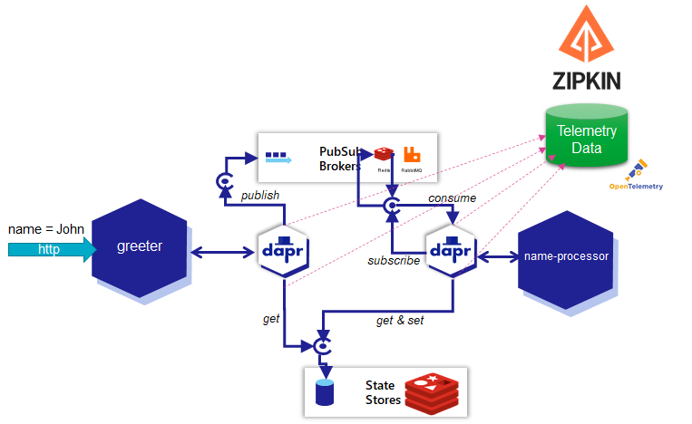

# Introducing NodeJS
- [Introducing NodeJS](#introducing-nodejs)
  - [Environment](#environment)
  - [Gentle introduction to Node applications](#gentle-introduction-to-node-applications)
    - [HelloWorld in Node](#helloworld-in-node)
    - [Functions in Node Applications](#functions-in-node-applications)
      - [resources](#resources)
    - [HelloWorld with NPM](#helloworld-with-npm)
    - [Asynchronous in Node](#asynchronous-in-node)
    - [Handle HTTP Request with Node](#handle-http-request-with-node)
  - [Node and Dapr](#node-and-dapr)
    - [A second application](#a-second-application)
  - [Node and Dapr - Pub/Sub for Asynchronous Communications](#node-and-dapr---pubsub-for-asynchronous-communications)
    - [Publishing from Node](#publishing-from-node)
  - [Leverage Dapr Pub/Sub between Front App and Node App](#leverage-dapr-pubsub-between-front-app-and-node-app)
  - [Telemetry, Traces and Dependencies](#telemetry-traces-and-dependencies)
  - [Resources](#resources-1)


This lab is only a very brief introduction of NodeJS and how to get started with it. You will run a few prepared Node applications, learn about some key aspects of the NodeJS programming language and the package system that Node applications use and you will implement a REST API using Node. 

## Environment

Downloads of the Node runtime for various Operating Systems are available on this [download page ](https://nodejs.org/en/download/). The installation of the Node runtime will include the installation of the *npm* package manager - that will be needed for some of the demo applications.

If you are new to Node, you may want to read a little introduction on Node and its history: [Introduction to Node](https://nodejs.dev/introduction-to-nodejs). 

When the installation is done, verify its success by running

`node -v`

on the commandline. This should run successfully and return the version label for the installed Node version.

Also run:

`npm -v`

on the commandline to verify whether *npm* is installed successully. This should return the version label for the installed version of *npm*. NPM is the Node Package Manager - the component that takes care of downloading and installing packages that provide modules with reusable functionality. Check the website [npmjs.com](https://www.npmjs.com/) to explore the wealth of the more than 1 Million packages available on NPM.

Fetch the resources for this hands on by cloning the Git repository:
```
git clone https://github.com/lucasjellema/fontys-2022-microservices-kafka-dapr
```
This creates a directory `fontys-2022-microservices-kafka-dapr` that contains the resources you will need.

## Gentle introduction to Node applications

We will very quickly take a look at Node applications. If you have seen Node in action before, you skip this section and continue on to the next section where you will work with Dapr.io and NodeJS microservices.

The results from the steps described below are available in the corresponding directories in the cloned Git repository. Instead of creating folders and files yourself, you can also inspect and run the sources in the Git repository. 

Note: for a more thorough yet quite accessible introduction to Node you may want to check out [this tutorial](https://nodejs.dev/learn/introduction-to-nodejs).
    
### HelloWorld in Node

On the machine and environment with the Node runtime, create a folder called *hello-world*. In this folder, create a file called *app.js*. Edit this file and add the following line of code:
```
console.log("Hello World!")
```
Save the file. On the command line, execute:
`node app.js`

This will run the Node runtime, load file app.js and interpret and execute its contents. You should see the string *Hello World* printed in the console. It may not be much yet, but it is your first Node application right there!

### Functions in Node Applications

You can define and call functions in Node. Additionally, you can store references to functions in variables and even pass these references in calls to other functions. You can instruct a function to call another function. 

All subsequent steps are already implemented in the file *hello-world-functions/app.js*. Either follow along using that file or create your own new file.

Let's first define a function
```
function print(message) {
    console.log(message)
}
```
and invoke it with this line:
```
print("Hello")
```
A function (reference) can be assigned to a variable. That function can be invoked through that variable. For example:
```
const otherPrint = function (message) {
    console.log(`Special type of printing: ${message}`)
}
```
Invoking this function can be done using:
```
otherPrint("Hello")
```

A second function can be created that takes a function reference as its input and invokes that function:
```
function execute (functionToCall, message) {
    functionToCall(message)
}
```

Using the following command, **print* and *otherPrint* can be invoked in an indirect way:
```
execute(print, "Hello")
execute(otherPrint, "Hello")
```

To really make things interesting, we can create a function reference together with state available to that function when it is executed and that is determined when the function reference is created. This is called a closure - the combination of the function to execute and the state to execute it with. This

Function *getPrintFunction* returns a reference to function (or a closure) that can subsequently be invoked. The closure is a function constructed inside another function and has access to all variables in the other scope (local variables as well as input parameters). When the closure is returned, the references inside the function to variables that existed outside of it are still valid. In this case, the value of input parameter *message* outside of the function that is returned is still available when the function reference that is returned to the caller is invoked. Multiple calls to getPrintFunction with different values for input parameter message result in multiple closures with each their own value for msg (taken from that input parameter) 

```
let printFunctionInstantiationCount = 0
function getPrintFunction(message) {
    let instanceSequence = ++printFunctionInstantiationCount // assign the current increased value to local variable to use in closure 
    return () => {
        console.log(`Printing from closure ${instanceSequence} the message ${message}`)
    }
}
```
Let's now use this closure generating function like this:
```
let pf1 = getPrintFunction("Hello")  // get hold of a closure - function plus state - that can be executed
let pf2 = getPrintFunction("World")  // a second closure,  based on the same function and with different state 

pf1() // execute the first closure
pf2() // execute the second closure
pf2() // execute closures as often as you want

execute(pf1) // the closure is a function reference that our function execute can invoke
``` 
#### resources
[Working With Closures in NodeJS](https://www.c-sharpcorner.com/UploadFile/f50501/working-with-closure-in-nodejs/)
[Introduction to Closures](https://learnnode.wordpress.com/2017/10/11/closure/)

### HelloWorld with NPM

On the machine and environment with the Node runtime, create a folder called *my-world-npm*. Navigate to this folder and run `npm init` to create a new application. Folder *hello-world-npm* contains the sample.

```
cd my-world-npm
npm init
```
Walk through the command line wizard. Feel free to either accept all default answers or provide your own values. When asked `Is this OK? (yes)` press enter. NPM will now create a package.json file based on your responses. Inspect the contents of this file.

Add a line with this content: `,    "start": "node index.js"` to the file, inside the `scripts` element and right under the line with the *test* script property. Save the file. 

Create a new file called *index.js* in this same directory. Add the line
```
console.log("Hello World!")
```
to this file. Now type `npm start` at the command line and press enter. We now leverage npm to take care of running the application. For this very simple application, you will not really see any difference yet: the code in *index.js* is executed.

### Asynchronous in Node
JavaScript is single threaded – no parallel threads can be started from your code. However: multiple actions can be in progress at the same time. Any action in Node that requires network or file system interaction is typically performed asynchronously: the command is started and handed to the Node background processes (that run parallel to the single foreground thread); the main thread continues with other work and when the background processes have completed the task, the results are returned to the invoker (when the main thread has an opening to attend to it).

The code discussed in this section can be found in file *hello-world-async/app.js*. Feel free to peruse that file or create your own.

The function *later* will print a message on the console output, but only do so after a specified period of time (in miliseconds) has passed:

```
function later(message, timeout) {
    setTimeout(() => {
        console.log(message)
    }, timeout)
}
```
Executing these lines will print three pieces of text. But in which order?
```
later("Hello", 2000)
later("World", 1000)
console.log("Goodbye!")
```
Here we see that when the timeout expires, the indicated function (closure) is executed.

Note: 
```
() => {
        console.log(message)
    }
```
defines an anonymous function that takes no input parameters and is equivalent to
```
function () {
  console.log(message)
}
```
where *message* is taken from the closure that includes the input parameter *message* from the outer function *later* that produced this inner function.  

This next piece of code will make an HTTP request that fetches a text document from URL [raw.githubusercontent.com/chrisbuttery/greeting/master/greetings.json](https://raw.githubusercontent.com/chrisbuttery/greeting/master/greetings.json) that contains a JSON-like array of greeting messages. The standard Node module *https* is enlisted to make this request - and so it is imported using the *require* statement.

Passed to *https.get* is a aonymous callback function - that Node will invoke once the asynchronous action of sending the HTTP request and receiving the response is complete. The callback function writes a randomly selected message from the retrieved set of greetings.

When this asynchronous action is put in motion, the main thread continues. With the call to *later*, the message *World* is scheduled for printing - when 1 ms has passed. And the final action in the main thread is the synchronous printing of *Hello*. When the main thread is done, two asynchronous actions will make their belated contributions.

```
const https = require('https')

https.get('https://raw.githubusercontent.com/chrisbuttery/greeting/master/greetings.json',
    function (res) {
        res.setEncoding('utf8');
        res.on('data', (chunk) => { // function to callback when body of http response is received
            let greetingsArray = JSON.parse(`{ "data" : ${chunk} }`).data
            let randomGreetingIndex = Math.floor(Math.random() * greetingsArray.length)
            console.log(greetingsArray[randomGreetingIndex])
        });
    })

later("World", 1)
console.log("Hello")
```
Run this code a few time to be greeted in a variety of ways.

Finally, let's look at the *async* and *await* keywords and the concept of *promises*. Create a function:
```
const slow = async function (name) { // async function returns a Promise, not yet a real value
    return ("Hello "+ name)
}
```
Note the *async* keyword that marks this function as an asynchronous function. Such as function returns a Promise - a reference to result that will be produced at some point, probably in the future. 

Function *main* calls function *slow* using the *await* keyword. This forces processing of the main thread to wait for the result from *slow* to be truly available - not just the Promise must be there, but it has to be resolved as well. The second call to *slow* does not have this *await* prepended to it. It does not wait for the real value, but settles for the Promise itself. Variable *message2* does not contain the string that function *slow* produces, but instead the Promise that is returned as a result of the *async* designation. The

In the last line of function *main* you see how we can retrieve the real value from a Promise, using *then( <function>)*. The anonymous function is called with the Promise's value when it becomes available.

```
async function main() {
  console.log("Start")
  let message = await slow("Joanne") // await forces a wait until the Promise can render the real value
  console.log("Slow Message: "+message)
  let message2 = slow("Johnny") // without await, the value of message2 is the (initially unresolved) Promise
  console.log("Slow Message: "+message2) // no proper message is available yet
  message2.then((msg) => {console.log("Slow Message after the Promise was resolved: "+msg)}) // .then is a way to force a wait for the promise to be resolved into a real value
}

main()
```
Note: you may wonder about the use of a separate function *main*. However, the keyword *await* cannot be used outside the scope of an async function.

You may also wonder why you would want to use Promise.then() instead of simply await. Well, with *await* the processing is stopped. However, with promises we can have multiple asynchronous functions executing in parallel, waiting for all their results to become available - or even the first result to become available. This

Rewrite *main* for example to:
```
async function main() {
    let p1 = slow("Mary")
    let p2 = slow("Edith")
    let p3 = slow("Tom")

    Promise.all([p1, p2, p3]).then(function (values) {
        for (const message of values) {
            console.log(message)
        }
    });
}
```
Here, three concurrent Promises are retrieved and we wait for all of them to produce their result instead of waiting for one of them in particular. Using [Promise.any](https://developer.mozilla.org/en-US/docs/Web/JavaScript/Reference/Global_Objects/Promise/any) we can wait for the first promise to produce a value and continue.

### Handle HTTP Request with Node
We will make a Node application now that is a little bit more interesting than what we did before. This application will be capable of handling an HTTP request that passes in a query parameter; it will read the parameter and return an appropriate and friendly message.

On the machine and environment with the Node runtime, create a folder called *my-world-web*. Navigate to this folder and run `npm init` to create a new application.  Folder *hello-world-web* contains the sample.

```
cd my-world-web
npm init
```
Walk through the command line wizard. Feel free to either accept all default answers or provide your own values. When asked `Is this OK? (yes)` press enter. NPM will now create a package.json file based on your responses. Inspect the contents of this file.

Add a line with this content: `,    "start": "node index.js"` to the file, inside the `scripts` element and right under the line with the *test* script property. Save the file. 

Create a new file called *index.js* in this same directory. Add the following contents to the file:

```
const http = require('http')
const url = require('url')
const PORT = 3000

// create an HTTP server that handles HTTP requests; it is handed to parameters: the request and response objects
const server = http.createServer((req, res) => {
    if (req.method === 'GET') {
        // get all query parameters from the URL
        const query = url.parse(req.url, true).query
        // return the HTTP response; use the value of the name parameter if it was provided, or use World if it was not
	    	res.setHeader('Content-Type', 'text/html');
        res.end(`Hello ${query.name ? query.name : "World"}`)
    }
})
server.listen(PORT);
console.log(`HTTP Server is listening at port ${PORT} for HTTP GET requests`)
```
Save the file.

On the command line, type `npm start` to execute the application. The HTTP Server is now listening for HTTP Requests at `localhost`, on *port 3000*.

From the command line using *curl* or *wget* or from your browser send an HTTP Request: [http://localhost:3000?name=John+Doe](http://localhost:3000?name=John+Doe)

```
curl http://localhost:3000?name=John+Doe 
```
You should receive an appropriate response from the service. Feel free to make some additional calls - and of course to modify the code to get some more interesting results. 
```
curl http://localhost:3000?name=Janet+Doe 
curl http://localhost:3000?name=Sandra+Buck 
curl http://localhost:3000?name=Randy+Deer 
curl http://localhost:3000?name=Fluffy+Bunny 
```

Resource: [Node documentation on http-module](https://nodejs.org/api/http.html), [Introduction to cURL](https://developer.ibm.com/articles/what-is-curl-command/)

## Node and Dapr
Let us find out how the Dapr sidecar and the services it can deliver can be engaged from Node applications. The code discussed in this section are in the directory *hello-world-dapr*.

The Dapr Node SDK has been installed using NPM with this statement (you do not have to execute this statement, although it does not hurt when you do):
```
npm i dapr-client --save
```
Check package.json. It includes the dependency of the Node application on the dapr-client module. The modules themselves are downloaded into the *node-modules* directory, when you execute this command (this one must be executed because otherwise the code will not work):

```
npm install
```
which reads the dependencies in package-lock.json or package.json and downloads and installs all direct (and indirect) dependencies.

Check out the *app.js* file. It contains a small application that handles HTTP requests: it stores the name passed in the request and stores it as state (in a Dapr state store). It keeps track of the number of occurrences of each name and reports in the HTTP response how many times a name has been mentioned.

The Node application is started through Dapr and as such gets a Dapr sidecar that handles the state related activities. The Node application uses the Node SDK to communicate with the Sidecar - instead of and much more convenient and elegant then explicit HTTP or gRPC interactions.  

This diagram gives an overview of the application.


Function *retrieveIncrementSave* is where the real action is when it comes to leveraging the Dapr sidecar. It gets and saves state - without knowing any of the details of the state store (which for now happens to Redis Cache, but could be changed to MySQL or any type of store without any impact on the Node application). The definition of *client* is a crucial linking pin: the client connects the Node application to the Dapr side car.

The application does one other thing of interest: it reads from the state store the value stored under key *instance-sequence-number*. It increases that number (or sets it to 1 if it does not yet occur) and uses it for its own identfication. Multiple instances if this application can run - at the same time or at different points in time - and each will have their identification.

Run the application using these commands; Dapr will know the application as *nodeapp*:

```
export DAPR_HTTP_PORT=3510
export APP_PORT=3110
dapr run --app-id nodeapp  --app-port $APP_PORT --dapr-http-port $DAPR_HTTP_PORT node app.js
```
You will find that the logging from the Sidecar and the Node application appear in the same terminal window. The logging shows the identification number assigned to the currently running instance. It will probably be *one*. If you stop the application and start it again, it should be incremented by one.

Make a request to the application - you will need a second terminal window for this - a plain HTTP request directly to the application:
```
curl http://localhost:3110/?name=Joseph
```
You will get a response that indicates how often this name has occurred before. Make the same request again and find that the instance count has increased.

A different way to make the request is not directly to the Node application and the port it is listening on, but instead to the Dapr sidecar - the application's personal assistant. The sidecar can apply authorization on the request, register telemetry and perform load balancing when multiple instances of the application would be running.

The request through the sidecar is standardized into a somewhat elaborate URL:
```
curl localhost:3510/v1.0/invoke/nodeapp/method/?name=Joseph
```
The first part - localhost:3510 - refers to the Dapr sidecar and the HTTP port on which it is listening. The next segment - /v1.0/invoke - identifies the Dapr API we want to access. Subsequently we inform this API through /nodeapp that we want to interact with the application that Dapr knows as *nodeapp* and we want to pass the URL query parameter *name* with *Joseph* as its value.  

Stop the Node application and its Dapr sidecar. Ctrl+C in the terminal window where you started the application should do the trick. Then start the application again. Make the same curl call as before:
```
curl http://localhost:3110/?name=Joseph
```

This should convince you that the state written by the application survives the application. As long as the container with the Redis Cache is running, the state will be available across multiple application restarts and even multiple application instances.

### A second application

We will now add a second application to the mix. It is defined in the file *front-app.js*. This application also handles HTTP requests with a name in it. To be honest: it a very flimsy front end that has the *nodeapp* do the real work - such as name counting and state managing. The *frontapp* invokes *nodeapp*. 

Note: normally, frontapp would have its sidecar make the call to the nodeapp Dapr-application's sidecar without needing to know where it runs. However in some environments this does not seem to work as a result of incorrect name resolution. To work around this issue, we have *frontapp* call directly to the *nodeapp*'s sidecar instead of its own. This somewhat reduces the elegance of using the sidecars and is an unfortunate and tenmporary workaround.

This diagram visualizes the situation with the two applications and their sidecars.



Start the *frontapp* using these commands:
```
export NODE_APP_DAPR_PORT=3510
export APP_PORT=3220
export DAPR_HTTP_PORT=3620
dapr run --app-id frontapp  --app-port $APP_PORT --dapr-http-port $DAPR_HTTP_PORT node front-app.js
```
Then make a call to the *frontapp* application using curl:
```
curl localhost:3220/?name=Johnny
```
This next call to the *frontapp* through its sidecar should work - but it does not in all environments; if it fails for you, just ignore it. It probably has to do with name resolution on your system and is not important for this handson lab.
```
curl localhost:3620/v1.0/invoke/frontapp/method/greet?name=Klaas
```
Application *frontapp* has registered with Dapr and should be known to *nodeapp*'s Dapr sidecar, so this call will work - invoking *frontapp* via this sidecar for *nodeapp*:
```
curl localhost:3510/v1.0/invoke/frontapp/method/greet?name=Klaas

curl localhost:3510/v1.0/invoke/nodeapp/method/?name=Joseph
```
You should see the name occurrence increase with each call.

Now kill *nodeapp*.

Try:
```
curl localhost:3220/?name=Johnny
```
An exception is reported (because front-could not reach nodeapp). 

Restart *nodeapp*. The application instance number is increased compared to before when you make these calls - into *frontapp* (and indirectly to *nodeapp*) and directly to *nodeapp*: 

```
curl localhost:3510/v1.0/invoke/frontapp/method/greet?name=Klaas

curl localhost:3510/v1.0/invoke/nodeapp/method/?name=Joseph
```
Note that the greeting # keeps increasing: the name and the number times it has occurred is stored as state and persists across application restarts.

However, it is not ideal that frontapp depends on nodeapp in this way, and has to report an exception when nodeapp is not available.

We will make some changes:
* *frontapp* will publish a message to a pub/sub component (in Dapr, this is by default implemented on Redis)
* *nodeapp* will consume messages from the pub/sub component and will write the name to the state store and increase the occurrence count
* *frontapp* will no longer get information from *nodeapp*; it will read directly from the state store; however: it will not write to the state store, that is still the responsibility and prerogative only of *nodeapp*. 

Stop all running applications before starting the next section.

## Node and Dapr - Pub/Sub for Asynchronous Communications

Focus now on folder *hello-world-async-dapr*. It contains the app.js and front-app.js files that we have seen before - but they have been changed to handle asynchronous communications via the built in Pub/Sub support in Dapr based in this case on the out of the box Redis based message broker.

Run 
```
npm install
```
to have the required npm modules loaded to the *node-modules* directory.

Check file *~/.dapr/components/pubsub.yaml* to see how the default Pub/Sub component is configured. It gives a fairly good idea about how other brokers could be configured with Dapr, brokers such as RabbitMQ or Apache Kafka.
```
cat ~/.dapr/components/pubsub.yaml
```
The name of the component is *pubsub* and its type is *pubsub.redis*. Daprized applications will only mention the name (*pubsub*) when they want to publish or consume messages, not refer to *redis* in any way. They do not know about the *redis* subtype and if it changes (when for example a Pulsar or Hazelcast message broker is introduced), they are not impacted.

Inspect the file *consumer.js* that contains a Dapr-based message consumer application. This application constructs a Dapr Server - an object that received requests from the Dapr Sidecar. Before, we saw the Dapr Client, that is used for sending instructions to the Sidecar.

Using this DaprServer, a subscription is created for messages on topic *orders* on pubsub component *pubsub*. This subscription is provided an anonymous and asynchronous handler function that will be invoked for every message the Sidecar retrieves from the message topic. 

Run the simple sample message consuming application *order-processor*:
```
export APP_PORT=6002
export DAPR_HTTP_PORT=3602
dapr run --app-id order-processor --app-port $APP_PORT --dapr-http-port $DAPR_HTTP_PORT --dapr-grpc-port 60002 node consumer.js
```

Check the logging to find that the application is listening on HTTP port 6002 to receive any messages that the Dapr sidecar (the personal assistant to the application) may pick up based on the topic subscription.

This diagram visualizes the current situation:


To publish a message to the *orders* topic in the default *pubsub* component, run this CLI command:
```
dapr publish --publish-app-id order-processor --pubsub pubsub --topic orders --data '{"orderId": "100"}' 
```
This tells Dapr to publish a message on behalf of an application with id *order-processor* (which is the application id of the only Dapr sidecar currently running) to the pubsub component called *pubsub* and a topic called *orders*. 

Check in the logging from the consumer application if the message has been handed over by the Dapr sidecar to the application (after consuming it from the topic on the pubsub component).

### Publishing from Node

The publisher application *orderprocessing* is a simple Node application that sends random messages to the *orders* topic on *pubsub*. Check the file *publisher.js*.  It creates a Dapr client - the connection from Node application to the Sidecar - and uses the *pubsub.publish* method on the client to publish messages to the specified TOPIC on the indicated PUBSUB component. Through the Dapr component definitions (yaml files), multiple pubsub components (backed by the same or by different providers such as Redis, RabbitMQ, Hazelcast) can be defined, each with their own name. The default components file contains the *pubsub* component, backed by Redis Cache.

Run the application with the following statement, and check if the messages it produces reach the consumer:

```
export APP_PORT=6001
export DAPR_HTTP_PORT=3601
dapr run --app-id orderprocessing --app-port $APP_PORT --dapr-http-port $DAPR_HTTP_PORT node publisher.js 
```
The publisher application is started and publishes all it has to say - to its Dapr Sidecar. This loyal assistant publishes the messages onwards, to what we know is the Redis Pub/Sub implementation.

This diagram puts it into a picture:


These messages are consumed by the *consumer* app's Sidecar because of its subscription on the *orders* topic. For each message, a call is made to the handler function. 

Check the logging in the terminal window where the *consumer* app is running. You should see log entries for the messages received. Note that the messages in the log on the receiving end are not in the exact same order as they were sent in. They are delivered in the original order and each is processed in its own instance of the handler function. Since the messages in this case arrive almost at the same time and the processing times for the messages can vary slightly, the order of the log messages is not determined. 

Stop the consumer application. 

Run the publisher application again. Messages are produced. And they are clearly not received at this point because the consumer is not available for consuming them. Are these messages now lost? Has communication broken down?

Start the consumer application once more to find out:
```
export APP_PORT=6002
export DAPR_HTTP_PORT=3602
dapr run --app-id order-processor --app-port $APP_PORT --dapr-http-port $DAPR_HTTP_PORT node consumer.js
```

You should see that the messages published by the publisher application when the consumer was stopped are received by the consumer now that it is running again. This is a demonstration of asynchronous communication: two applications exchange messages through a middle man - the pubsub component - and have no dependency between them.  

The handshake between Dapr sidecar and pubsub component on behalf of the consumer is identified through the app-id. Messages are delivered only once to a specific consumer. When a new consumer arrives on the scene - with an app-id that has not been seen before - it will receive all messages the queue is still retaining on the topic in question.

Stop the consumer application.

Start the consumer application *with a new identity* - defined by the *app-id* parameter: 
```
dapr run --app-id new-order-processor --app-port $APP_PORT --dapr-http-port $DAPR_HTTP_PORT node consumer.js
```
and watch it receive all earlier published messages. 

## Leverage Dapr Pub/Sub between Front App and Node App
As was discussed before, we want to break the synchronous dependency in the front-app on the node-app. To achieve this, we will make these changes:
* the frontapp will publish a message to the *names* topic on the default pub/sub component 
* the nodeapp will consume messages from this *names* topic on the pub/sub component and will write the name from each message it consumes to the state store and increase the occurrence count for that name
* the frontapp will no longer get information from synchronous calls to the nodeapp; it will read directly the occurrence count for a name from the state store; however: it will not write to the state store, that is the task for nodeapp. 

Here we see a very simplistic application of the *CQRS* pattern where we segregate the responsibility for reading from a specific data set and writing data in that set.

The front-app.js file is changed compared to the earlier implementation:
* publish a message to the *names* topic on *pubsub* for every HTTP request that is processed
* retrieve the current count for the name received in an HTTP request from the state store (assume zero if the name does not yet occur) and use the name count increased by one in the HTTP response  

The Dapr client is used for both publishing the message and for retrieving state. The direct call from *front-app.js* to the (other) Node application has been removed.

Run the *frontapp* with these statements:

```
export APP_PORT=6030
export DAPR_HTTP_PORT=3630
dapr run --app-id greeter --app-port $APP_PORT --dapr-http-port $DAPR_HTTP_PORT node front-app.js 
```
Check in the logging that the application was successfully started.

Make a number of calls that will be handled by the front-app:
```
curl localhost:6030?name=Jonathan
curl localhost:6030?name=Jonathan
curl localhost:6030?name=Jonathan
```
You will notice that the number of occurrences of the name is not increasing. The reason: the *frontapp* cannot write to the state store and the application that should consume the messages from the pubsub's topic is not yet running and therefore not yet updating the state store. Here is an overview of the situation right now:
  

So let's run this *name-processor* using these statements:
 
```
export APP_PORT=6031
export SERVER_PORT=6032
export DAPR_HTTP_PORT=3631
dapr run --app-id name-processor --app-port $APP_PORT --dapr-http-port $DAPR_HTTP_PORT node app.js 
```
The logging for this application should show that the messages published earlier by *frontapp* are now consumed, and the statestore is updated. 

Here is the situation in a picture:


Note: this implementation is not entirely safe because multiple instances of the handler function, each working to process a different message, could end up in *race conditions* where one instance reads the value under a key from the state store, increases it and saves it. However, a second instance could have read the value right after or just before and do its own increment and save action. After both are done, the name occurrence count may be increased by one instead of two. For the purpose of this lab, we accept this possibility.    

Make a number of calls that will be handled by the front-app:
```
curl localhost:6030?name=Jonathan
curl localhost:6030?name=Jonathan
curl localhost:6030?name=Jonathan
```
You will notice that the number of occurrences of the name is (still) not increasing. However, when you check the logging for the name-processor, you should also see that it is triggered by an event that contains the name *Jonathan* and it is keeping correct count. So whay does the front-app not produce the same number of occurrences?

This has to do with different modes of operation of the Dapr state store. By default, every application has its own private area within the state store. Values stored by one application are not accessible to other applications. In this example, *name-processor* records the name and the occurence count. And when the front-app retrieves the entry for the name from the state store, it will not find it (in its own private area).

We can instruct Dapr to use a state store as a global, shared area that is accessible to all applications.  See [Dapr Docs on global state store](https://docs.dapr.io/developing-applications/building-blocks/state-management/howto-share-state/).

Copy the default state store component configuration to the local directory, as well as the *pubsub* component configuration: 
```
cp ~/.dapr/components/statestore.yaml .
cp ~/.dapr/components/pubsub.yaml .
```
Check the contents of the file that specifies the state store component:
```
cat statestore.yaml
```
You see how the state store component is called *statestore* and is of type *state.redis*. Now edit the file and add a child element under metadata in the spec (at the same level as redisHost):
```
  - name: keyPrefix
    value: none  # none means no prefixing. Multiple applications share state across different state stores
```
This setting instructs Dapr to treat keys used for accessing state in the state store as global keys - instead of application specific keys that are automatically prefixed with the application identifier.

Save the file.

Stop both the frontapp and the name-processor applications.

Start both applications - with the added components-path parameter. This parameter tells Dapr to initialize components as defined by all the yaml files in the indicated directory (in this case the current directory). That is why you had to copy the pubsub.yaml file as well to the current directory, even though it is not changed. If you would not, it is not found by Dapr and call attempts to publish messages to topics on *pubsub* or subscribe to such topics will fail.


In one terminal, start the *greeter* application:
```
export APP_PORT=6030
export DAPR_HTTP_PORT=3630
dapr run --app-id greeter --app-port $APP_PORT --dapr-http-port $DAPR_HTTP_PORT --components-path .  node front-app.js 
```
and in a second terminal run *name-processor*:
```
export APP_PORT=6031
export SERVER_PORT=6032
export DAPR_HTTP_PORT=3631
dapr run --app-id name-processor --app-port $APP_PORT --dapr-http-port $DAPR_HTTP_PORT --components-path . node app.js 
```

Again, make a number of calls that will be handled by the front-app:
```
curl localhost:6030?name=Michael
curl localhost:6030?name=Michael
curl localhost:6030?name=Michael
curl localhost:6030?name=Jonathan
```
At this point, the front-app should get the increased occurrence count from the state store, saved by the name-processor app, because now both apps work against the global shared state store. 

## Telemetry, Traces and Dependencies
Open the URL [localhost:9411/](http://localhost:9411/) in your browser. This opens Zipkin, the telemetry collector shipped with Dapr.io. It provides insight in the traces collected from interactions between Daprized applications and via Dapr sidecars. This helps us understand which interactions have taken place, how long each leg of an end-to-end flow has lasted, where things went wrong and what the nature was of each interaction. And it also helps learn about indirect interactions.



Query Zipkin for traces. You should find traces that start at *greeter* and also include *name-processor*. You now that we have removed the dependency from *greeter* on *name-processor* by having the information flow via the pubsub component. How does Zipkin know that greeter and name-processor are connected? Of course this is based on information provided by Dapr. Every call made by Dapr Sidecars includes a special header that identifies a trace or conversation. This header is added to messages published to a pubsub component and when a Dapr sidecar consumes such a message, it reads the header value and reports to Zipkin that it has processed a message on behalf of its application and it includes the header in that report. Because Zipkin already received that header when the Dapr sidecar that published the message (on behalf of the greeter application) reported its activity, Zipkin can construct the overall picture.

When you go to the Dependencies tab in Zipkin, you will find a visual representation of the dependencies Zipkin has learned about. Granted, there are not that many now, but you can imagine how this type of insight in a complex network of microservices could add useful insights.

## Resources

[Dapr Docs - Pub/Sub](https://docs.dapr.io/developing-applications/building-blocks/pubsub/pubsub-overview/)
[Dapr Docs - State Management](https://docs.dapr.io/developing-applications/building-blocks/state-management/state-management-overview/)
[Dapr Docs - Shared State between Applications](https://docs.dapr.io/developing-applications/building-blocks/state-management/state-management-overview/#shared-state-between-applications)


