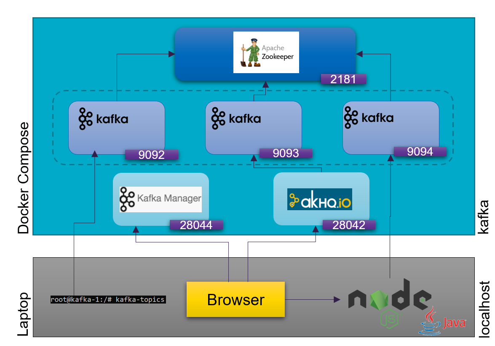
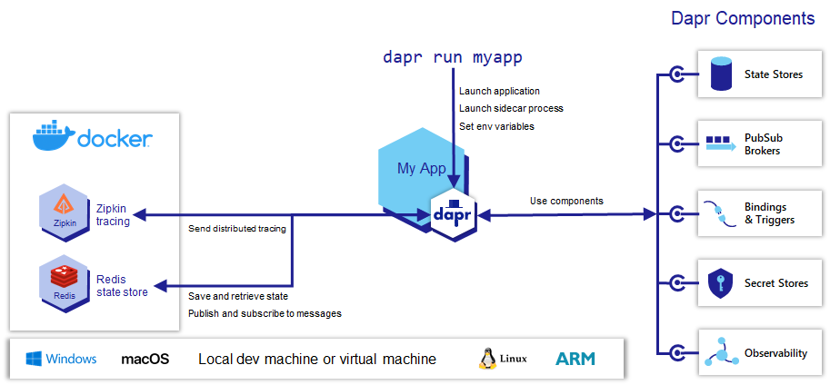

# Environment for the Apache Kafka Introduction Workshop
- [Environment for the Apache Kafka Introduction Workshop](#environment-for-the-apache-kafka-introduction-workshop)
  - [Preparing Docker Compose](#preparing-docker-compose)
    - [Docker Compose locally](#docker-compose-locally)
    - [Docker Compose in a VM](#docker-compose-in-a-vm)
  - [Run Docker Compose to Create Apache Kafka Platform](#run-docker-compose-to-create-apache-kafka-platform)
  - [Verify Success of Running Platform](#verify-success-of-running-platform)
  - [Node Runtime](#node-runtime)
  - [Setting up Dapr.io](#setting-up-daprio)
    - [a. Installing the Dapr.io CLI](#a-installing-the-daprio-cli)
    - [b. Initialize Dapr in your local environment](#b-initialize-dapr-in-your-local-environment)
  - [Text Editor or (light weight) IDE](#text-editor-or-light-weight-ide)
  - [Browser](#browser)

The workshop makes use of a three-node Apache Kafka Cluster that relies on Zookeeper for bookkeeping across the cluster nodes also known as brokers. In addition to this cluster, Kafka Manager and Kafka HQ are used - two tools that support observing and managing the Kafka Cluster. Six Docker Containers will run these components and Docker Compose is used to coordinate these containers. Your lab-environment needs to be able to run Docker Compose - inside a VM or on your local OS. 

Some of the labs in this workshop use Node (JS) applications. It is therefore required to also have a Node runtime environment. Optionally you can make use of Java applications to interact with your Kafka Cluster; for this you will need a Java Runtime Environment.

We will also use Dapr.io. Dapr is an open source project - Distributed Application Runtime - that provides a personal assistant to any application that makes common tasks much easier. Dapr's other main function is to facilitate the interaction between microservices - synchronous and asynchronous. Dapr.io was installed in our previous workshop.

The environment you will work in can be visualized like this:



Note the numbers shown on each of the containers: these are the ports on which the applications in the containers are exposed on the Docker Host machine.

### Free and ready to go Apache Kafka Cloud Service
To very quickly get started with Apache Kafka, you do not even have to install it locally. You can instantiate - for free! - a Kafka Cluster in the CloudKarafka cloud service and configure all programmatic Kafka interaction with that instance instead of with a local instance. Follow the instructions in this blog article [A Free Apache Kafka Cloud Service – and how to quickly get started with it](https://technology.amis.nl/cloud/a-free-apache-kafka-cloud-service-and-how-to-quickly-get-started-with-it/) to get your CloudKarafka instance up and running. (you may stop reading that article once you have completed the section *Try out the new Cloud Karafka Ducky Plan Instance* )  

### Local installation steps

* [Prepare Docker Compose](#preparing-docker-compose)

* [Run Docker Compose to Create Apache Kafka Platform](#Run-Docker-Compose-to-Create-Apache-Kafka-Platform)

* [Verify Success of Running Kafka Platform](#Verify-Success-of-Running-Platform)

* [Node and NPM Runtime](#Node-Runtime)

## Preparing Docker Compose 
Docker Compose is a tool for defining and running multi-container Docker applications such as the Apache Kafka Platform we use in this workshop. With Compose, you use a YAML file to configure your application's services - the *docker-compose.yml* file in this directory. Then, with a single command, you create and start all the services from your configuration. Docker Compose relies on Docker Engine for any meaningful work, so make sure you have Docker Engine installed either locally or remote, depending on your setup.

### Docker Compose locally 
 Details on installing Docker Compose and Docker locally can be found [here](https://docs.docker.com/compose/install/). Note that Docker Compose is included with Docker Desktop for Windows. 

### Docker Compose in a VM
To keep your environment *clean* - you may choose to run the workshop (largely) inside a VM. That is how this workshop was prepared as well.

A nice way to quickly construct a VM with Docker and Docker Compose inside is through the use of two tools:
* Oracle VirtualBox [https://www.virtualbox.org/]
* Hashicorp Vagrant [https://www.vagrantup.com/]

The steps for creating a VM that will run the workshop are straightforward:
1. install Oracle Virtualbox on your laptop
2. install Vagrant on your laptop
   * two plugins for Vagrant need to be installed as well, with the following two commands:
   ```
   vagrant plugin install vagrant-disksize
   vagrant plugin install vagrant-docker-compose
   ```
3. inspect the file *Vagrantfile* located in the current directory; this file contains the definition of the VM: an Ubutunu Linux environment with 8GB of RAM and 25GB of Diskspace, a fixed IP address and Docker and Docker Compose pre installed. Note: the Vagrantfile defines an IP address for the VM; this is the address at which the VM is accessible from the Host machine (your laptop on which the VM is running). You can change the IP address to another value if for example this address is already occupied
4. open a command line window in the current directory (that contains the file *Vagrantfile*); 
5. execute `vagrant up` in the command window. Vagrant will now work together with VirtualBox to construct the VM; this can take quite some time (5-15 minutes), depending primarily on your download speed.
6. once *Vagrant* indicates it is done, a VM is running on your local machine - ready for some action. You could inspect the Oracle VirtualBox Client to see details on the newly created VM.
7. try to ping the VM `ping 192.168.188.110` (or the IP address you defined in the *Vagrantfile*)
8. on the command line, type `vagrant ssh`. This should open a terminal session into the VM. Type `docker ps` to verify if Docker has been installed (and that no containers are currently running)
9. execute the following command to get a local copy of the GitHub Repo for this workshop: `git clone https://github.com/AMIS-Services/online-meetups-introduction-of-kafka`. 

Change the directory to `kafka-introduction-workshop/environment` and type `ls`. You should see a listing of files that includes *Vagrantfile*, this *readme.md* file and *docker-compose.yml*.  

## Run Docker Compose to Create Apache Kafka Platform
The *docker-compose.yml* file defines six services (aka containers) that together form the heart of the Apache Kafka workshop:
* Zookeeper - bookkeeping across the cluster nodes 
* Three Apache Kafka Brokers
* Apache Kafka Manager - A GUI to monitor and observe an Apache Kafka Cluster
* Apache Kafka HQ - Also a GUI to monitor and observe an Apache Kafka Cluster

By running Docker Compose with this configuration file, we may expect to end up with six running containers, somewhat linked to each other and together providing the Apache Kafka Platform.

Note: before you run docker compose, you need to define an Environment Variable called PUBLIC_IP, set to the IP address on which the local host machine can access the Docker host. This can be 127.0.0.1 when you run Docker Compose locally or it can be the IP address of the VM inside which you have Docker Compose running or even the Public IP address of the Compute Instance in which you run Docker Compose. 

On Linux and MacOS this would be something like:

`export PUBLIC_IP=192.168.188.110` 

and on Windows for example:
`set PUBLIC_IP=127.0.0.1`

Run this command on the command line in the directory that contains the *docker-compose.yml* file.

`docker compose -f docker-compose.yml up -d`

Note: since the default name for the docker-compose file is *docker-compose.yml* you can leave it off, and simply use:

`docker compose up -d`


## Verify Success of Running Platform

When all images have been pulled and Docker Compose indicates that alle configured containers have been created, you can check on the Docker host if all containers are indeed running:

`docker ps`

You should now see a list of six new containers running successfully.  

In a browser on the host machine, you can access the Apache HQ GUI to verify success:
http://192.168.188.110:28042/ (in case you run with the Vagrant defined VirtualBox VM) or http://127.0.0.1:28042/ or http://localhost:28042/ if you run outside the VM. 

This URL is composed from the IP of the (VM that contains the) Docker Host and the port to which the AKHQ container port 8080 has been mapped in the *docker-compose.yml* file.

Note: you could consider adding an entry to local */etc/hosts* or *C:\Windows\System32\drivers\etc\hosts* file to simplify working with the Kafka Platform now started in Docker Compose. 

`192.168.188.110		kafka	Docker Host running Apache Kafka and associated components `

Note: replace the IP address with the IP address of your Docker Host; this could be 127.0.0.1 if you run on MacOS or a Linux computer. It is the same value you used when setting the PUBLIC_IP environment variable. 

You can now stop the Kafka Platform using this command:
Run this command on the command line in the directory that contains the *docker-compose.yml* file.

`docker compose stop`

If you want to not only stop but also remove all containers that docker-compose is running, you may use:
`docker compose down`

When you run `docker-compose up` again, all containers will be recreated an started. This time this will happen much faster than the first time because all container images have already been pulled to your local Docker environment.

## Node Runtime
Some of the labs will use Node (JS) applications that will consume from and produce to Kafka Topics. These applications are used to demonstrate asynchronous interaction between microservices and an implementation of the CQRS pattern. To run these applications, you need to have a local Node Runtime environment. If you did not already install Node for the labs last week, then here is another chance. If you did already install, you can skip this section.

You can create the Node runtime in the same machine that runs Docker (Compose), or on a different host - as long as the Kafka Cluster is accessible.

Downloads of the Node runtime for various Operating Systems are available on this [download page ](https://nodejs.org/en/download/). The installation of the Node runtime will include the installation of the *npm* package manager - that will be needed for some of the demo applications.

If you are new to Node, you may want to read a little introduction on Node and its history: [Introduction to Node](https://nodejs.dev/introduction-to-nodejs). 

When the installation is done, verify its success by running

`node -v`

on the commandline. This should run successfully and return the version label for the installed Node version.

Also run:

`npm -v`

on the commandline to verify whether *npm* is installed successully. This should return the version label for the installed version of *npm*.

## Setting up Dapr.io
We will use Dapr.io in this lab. If you did not already install Dapr for the labs last week, then here is another chance. If you did already install, you can skip this section.

Dapr.io runs very well on Kubernetes. However, for simplicity sake we will go for the more straightforward approach. You will need an environment - MacOS, Windows, Linux - that has Docker running.  

Note: there is the possibility to run Dapr.io without Docker at all - see [Dapr.io self hosted without Docker](https://docs.dapr.io/operations/hosting/self-hosted/self-hosted-no-docker/) for details; however, that requires a lot of additional work and will limit your progress through today's hands on labs.

### a. Installing the Dapr.io CLI

Follow the instructions for installing the Dapr.io CLI that are provided on [this page](https://docs.dapr.io/getting-started/install-dapr-cli/).

Using
```
dapr
```
you should now have feedback that indicates a properly installed Dapr environment.

### b. Initialize Dapr in your local environment

Follow the instructions for initializing the Dapr environment that are provided on [this page](https://docs.dapr.io/getting-started/install-dapr-selfhost/). The outcome of this step should be three running containers: Dapr, Zipkin and Redis. The Redis container provides the default implementation for State Store and Pub Sub broker used by Dapr based on the Redis in memory cache. Zipkin collects telemetry and provides insight in tracing of requests to and from microservices through Dapr.

At this point, you have a virtual pool of personal assistants to draw support from for each of the applications and microservices you will run. These potential assistants when called into action can make use of the standard Dapr facilities for state management and pub/sub and for collecting telemetry and routing requests. We can easily add - and will so later in this lab - additional capabilities that these PAs can make use of.  




## Text Editor or (light weight) IDE
Obviously you will inspect scripts and source code in this workshop. Any text editor or development environment will do for this purpose. The workshop was prepared and tested using Visual Code - so that might be a good option for you.

## Browser
The Apache Kafka HQ GUI tool runs in a browser (that must be able to access the Kafka Cluster at the PUBLIC_IP). Any modern browser should do.