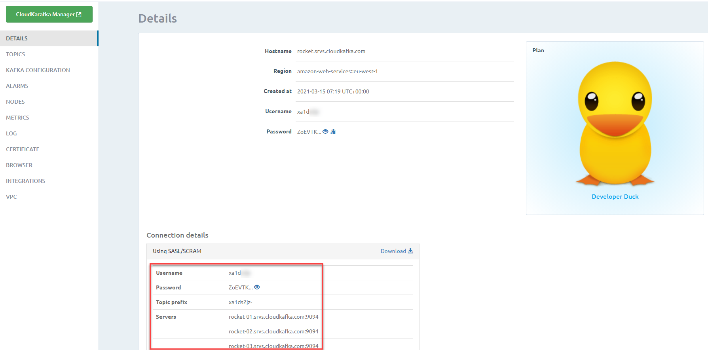

# Lab - Programmatic interaction with Apache Kafka from Node

TABLE OF CONTENTS

In the previous lab, you have produced and consumed messages manually, using Kafka Console and the Apache Kafka HQ GUI. In this lab, you will also produce and consume messages - this time in a programmatic way. You will use the Apache Kafka platform that you have prepared prior to the workshop using [the instructions on the environment](../lab3-kafka-environment/readme.md). as well as the Node run time environment.

You will interact with Kafka from Node in the pure form with one of the most popular libraries for using Kafka from Node applications. Next, you will take the lab around pub/sub based interaction you did earlier with Node and Dapr.io. Last time you did this lab, you used the Redis based Pub/Sub implementation shipped with Dapr. Now you are using the exact same code - and a slightly different configuration. This configuration replaces Redis with your local (or cloud based) Apache Kafka Cluster. To prove:
* how your Node application is technology independent because of Dapr.io
* how Dapr.io can work with pub/sub based on Redis just as easily as with Apache Kafka 


## Node interacting with Apache Kafka

The NPM module repository returns over 660 modules when searched for the keyword *kafka*. Not all of them are libraries to facilitate the interaction from your Node application with Apache Kafka clusters - but over a dozen are. In this lab, we will work with the *node-rdkafka* NPM module, [node-rdkafka on GitHub](https://github.com/Blizzard/node-rdkafka) for details on this particular library and [Reference Docs](https://blizzard.github.io/node-rdkafka/current/) for the API specification. The node-rdkafka library is a high-performance NodeJS client for Apache Kafka that wraps the native (C based) *librdkafka* library. All the complexity of balancing writes across partitions and managing (possibly ever-changing) brokers should be encapsulated in the library.

The sources for this part of the lab are in the directory *node-kafka-client* in the lab directory in the Git repo.

### Producing to test-topic in Node

Take a look at the *package.json* file. You will see a dependency configured on *node-rdkafka*:
```
  "dependencies": {
    "node-rdkafka": "^2.10.1"
  }
```
Now look at the file *produce.js*. The first line of this Node application also refers to *node-rdkafka*. When we execute *produce.js*, the Node runtime will try to load the module *node-rdkafka*. It will try to do so by locating a directory called *node-rdkafka* under the directory *node-modules* that lives in the root of the application. At this moment, you probably do not yet have this *node-modules* directory. It gets created when you instruct *npm* to download all libraries on which the application depends - as configured in *package.json*.

To get going, open a command line window and navigate to directory *lab-programmatic-consume-and-produce\node-kafka-client*. Then execute
```
npm install
```
This instructs *npm* to download and install in directory *node-modules* all modules that are required directly or indirectly by the application - as defined in the *dependencies* property in *package.json*.

It will take some time to complete this command. About 45MB worth of npm modules are downloaded.

This is as good a time as any to open file *produce.js* again and interpret what it does.

* compose configuration (primarily Kafka Broker endpoints)
* create a Producer (based on the configuration)
* prepare the Producer (with event handlers to respond)
* connect the Producer
* generate and produce events (Feel free to change the contents of the generated messages)
* disconnect the producer

Before you can run the producer application, make sure that the KAFKA_BROKERS configuration in *config.js* is correct for your environment - and that the KAFKA_TOPIC refers to a topic that already exists on your Kafka Cluster.

Note: if you use a Kafka Cluster on the CloudKarafka Cloud Service(see https://technology.amis.nl/cloud/a-free-apache-kafka-cloud-service-and-how-to-quickly-get-started-with-it/ for instructions on how to get going), you can use the file *consumeFromCloudKarafka.js*; you need to specify some of your CloudKarafka's account properties: username, password, server names, topic name.




When these conditions are met - and `npm install` is done installing the required node modules, it is time to produce some messages to the topic.  

Run this command:
```
node produce.js
```
You should see the following output:
```
Producer connection to Kafka Cluster is ready; message production starts now
producer rdkafka#producer-1 is done producing messages to Kafka Topic test-topic.
```
When you check either in Kafka Console or in Apache Kafka HQ, you should be able to see a batch of fresh messages published to the `test-topic` (or the topic you have specified if you have changed the name of the topic).

### Consuming from test-topic in Node
The obvious next step is the consumption of messages. We will again use a Node application for this. But please realize that their is absolutely no need for this. Once messages have been produced, we cannot even tell from which type of client they have been produced. So the producing application could have been Java, Python, C, .NET just as well as Node. And the consuming application could be implemented in any technology that has a way to interact with the Kafka Cluster. The choice for Node here is one of convenience.

Check the contents of the file *consume.js*. It has the same dependencies as *produce.js*, on both NPM module *node-rdkafka* and local file *config.js*. The implementation of consume.js has been done using the Stream Consumer; for the *traditional* approach, see *consume-non-stream.js*.

What goes on in the *consume.js* application?

* compose configuration (consists primarily of the Kafka Broker endpoints as well as the Configuration Group Id)
* create a StreamReader (based on the configuration, with the offset to the earliest message available on the topic and with subscription(s) on the topic(s) defined in config.js )
* prepare the StreamReader (with event handlers to respond to data events on the Stream that are emitted when a message is read from the Kafka Topic)
* define event handler for the disconnected event
* disconnect the consumer after 30 seconds (30000 ms)

Run the Kafka Consumer application:
```
node consume.js
```
This should print all messages on the *test-topic* to the console.

If you run the consumer application a second time, you will probably not see any messages - or only new ones. This is the effect of using a Consumer Group Id. The Kafka Cluster retains the Consumer Group Id and its corresponding offset. In the second run, the consuming applications joins the same Consumer Group as before. This group has already consumed all messages. If you now change the Consumer Group Id and run the Node application again, you will see all messages on the topic once more. This is because for this new Consumer Group, no messages at all have been read from the topic, and Kafka will offer up all messages from the beginning of time.

### Check in Apache Kafka HQ
Open AKHQ in a browser. It has been started as part of the **Kafka platform ** and can be reached on <http://kafka:28042/> (provided you added the IP address to the *hosts* file associated with the host name *kafka*).

Go to the Topics page and focus on *test-topic*. Verify that the messages published from the Node application show up. Take note of the consumer group registered for this topic: you should see the same label(s) as defined in the Node application.

Open the Consumer Groups page. You will see the consumer group details. If you run the *consume.js* application once more, you will the number of members for the consumer group go up nu one. When you drill down into the consumer group and inspect the members, you can see the type of client and the IP address for the member a well as the partition the member is linked to.

On the Topic page, you can produce a message to the *test-topic*. This message will of course be consumed by the *consume.js* application.


## Node interacting with Apache Kafka through Dapr.io

Focus on directory *node-kafka-dapr*. Run 
```
npm install
```
to bring in the Dapr SDK for Node. But not the *node-rdkafka* module. 

File *pubsub.yaml* defines a pubsub component. Make sure that the content of this file is configured correctly for your Apache Kafka environment (This basically means for local Kafka deployment that the brokers' endpoints need to have been defined correctly. When you make use of Cloud Karafka, you need a slightly extended configuration, with credentials):

```
apiVersion: dapr.io/v1alpha1
kind: Component
metadata:
  name: pubsub
  namespace: default
spec:
  type: pubsub.kafka
  version: v1
  metadata:
  - name: brokers # Required. Kafka broker connection setting
    value: "kafka-1:19092,kafka-2:29093,kafka-3:29094"
  - name: authType # Required.
    value: "none"
  - name: authRequired
    value: "false"
```    
The *orders* topic needs to be created on your Kafka Cluster. You can create the topic through the AKHQ web UI or through the Kafka CLI Tool:
```
docker exec -ti kafka-1 bash
kafka-topics --create --if-not-exists --zookeeper zookeeper-1:2181 --topic orders --partitions 3 --replication-factor 2
```

Run the same Daprized consumer application as earlier - not telling it anything about the change for Pub/Sub from Redis to Kafka:

```
export APP_PORT=6002
export DAPR_HTTP_PORT=3602
dapr run --app-id order-processor --app-port $APP_PORT --dapr-http-port $DAPR_HTTP_PORT --components-path .   node consumer.js
```
You should see in the logging that the pubsub component was loaded ("name: pubsub, type: pubsub.kafka/v1") and that a subscription is made on the PubSub component

To publish a message to the *orders* topic in the default *pubsub* component, run this CLI command:
```
dapr publish --publish-app-id order-processor --pubsub pubsub --topic orders  --data '{"orderId": "101", "product", "Apache Kafka Demo Kit"}' 
```
In the logging for the *order-processor* you should see evidence of the consumption of the message. 

The publisher application *orderprocessing* is a simple Node application that sends random messages to the *orders* topic on *pubsub*. Check the file *publisher.js*.  It creates a Dapr client - the connection from Node application to the Sidecar - and uses the *pubsub.publish* method on the client to publish messages to the specified TOPIC on the indicated PUBSUB component. 

Run the application with the following statement, and check if the messages it produces reach the consumer:

```
export APP_PORT=6001
export DAPR_HTTP_PORT=3601
dapr run --app-id orderprocessing --app-port $APP_PORT --dapr-http-port $DAPR_HTTP_PORT --components-path .  node publisher.js 
```
The publisher application is started and publishes all it has to say - to its Dapr Sidecar. This loyal assistant publishes the messages onwards, to what we know is the Apache Kafka pub/sub implementation.

When you check the messages in the AKHQ UI or using the Kafka command line you will see that they contain more data than our application put into them. The Dapr Sidecar decorates our application's payload with quite a bit of metadata, as you can see in this sample. The message that the application published in this case is found as the *data* property in the JSON message payload:

```
{
  "source": "orderprocessing",
  "type": "com.dapr.event.sent",
  "topic": "orders",
  "traceid": "00-1d8361f5392c720651aa10727694d255-93a147f099702644-01",
  "tracestate": "",
  "data": 737,
  "id": "02b95dbf-449c-4857-aa68-fe36a7a17333",
  "specversion": "1.0",
  "datacontenttype": "application/json",
  "pubsubname": "pubsub"
}
```
Other information is used by Dapr to provide telemetry tracing and routing information (for example reported through Zipkin), to cater for middleware such as authorization and advanced routing.  

When we consume the message through a Dapr sidecar, all we get is the payload itself. 

### Resources
Check [Detailed documentation on the Dapr.io Apache Kafka pubsub component](https://docs.dapr.io/reference/components-reference/supported-pubsub/setup-apache-kafka/).

A second way to use Apache Kafka through Dapr is with the Binding component: [Docs on Dapr Apache Kafka input and output binding component](https://docs.dapr.io/reference/components-reference/supported-bindings/kafka/).


## Bonus: Node Web Application
From the previous step it is but a small additional step to allow users to enter messages into a Web User Interface and send them for publication to a Kafka Topic. The first section shows such a (very simple) web application in Node, that allows you to send messages as query parameter in an HTTP GET request, for example by entering a URL in the location bar of your browser. 

The next section does something similar on the consuming end: publish a web application that makes the messages visible that have been consumed from the Kafka topic. To set the expectations at the right level: the response to an HTTP Request will be a JSON document with all messages received by the consumer. A more fancy UI is left as an exercise to the reader ;)
 
### Node Web Application for Producing Messages
Earlier in this lab we looked at a very simple Node web application: *hello-world-web*. Now we combine that web application with the Kafka Producer we worked on just before. Look in directory node-kafka-web-client and open file *web-producer.js*.

This Node application starts an HTTP Server to handle GET requests. It uses a query parameter called *message* for the content of the message to publish to the Kafka Topic. A module referenced as *./produce* is *required* into the *web-producer.js*. This is interpreted by the Node runtime as: find a local file *produce.js*, load it and make available as public objects anything in *module.exports*. The file *produce.js* is largely the same as before, only this time it does not automatically start generating and publishing messages and it has a function called *produceMessage* that produces one message to the KAFKA_TOPIC. This function is exported in *module.exports* and as such available in *web-producer.js*. Note: *producer.js* imports *config.js* - the file with the KAFKA Broker endpoints.  

Before you can run the application, you need to bring in the dependencies. From the command line in the directory that contains file *package.json* run:
```
npm install
```
to download all required NPM modules into the directory node-modules.

Now you can run the web application:
```
node web-producer.js
```
The HTTP server is started and listens on port 3001. You can send GET requests to this port that have a query parameter called *message*. Whatever value *message* has is used as the content of a message published to the Kafka Topic *test-topic*.

From a browser - or from the command line using tools such as *curl* or *wget* - make a GET request such as this one: [http://localhost:3001?message=My+Message+is+Hello+World](http://localhost:3001?message=My+Message+is+Hello+World).

You can check in Apache Kafka HQ or in the Kafka Console Consumer if the message arrives. Or go to the next section for the consuming web application in Node.


### Node Web Application for Consuming Messages

The consuming web application is very similar in structure to the producer we just discussed. The file *web-consumer.js* starts an HTTP Server that handles HTTP GET Requests. It will return a JSON document with whatever value is returned by the function *consumer.getMessages*. This function is loaded from module *./consume* and exported in *consume.js* in *module.exports*. 

Check the contents of *consume.js*: it should look familiar. New compared to the earlier implementation of *consume.js* is the *messages* array in which all messages consumed from the Kafka Topic are collected - the latest at the top or beginning of the array. The *on data* handler on the stream adds the message contents to this array and the function *getMessages* returns the array. This function is exported for the benefit of external consumers in *module.exports*. 

Run the web application:
```
node web-consumer.js
```
The HTTP server is started and listens on port 3002. You can send GET requests to this port to get a JSON document with all messages consumed from Kafka Topic *test-topic*: [http://localhost:3002](http://localhost:3002).

If you keep both web producer and web consumer running at the same time, you can see the effect of one in the other.

Publish another message: 
[http://localhost:3001?message=A+brand+new+message](http://localhost:3001?message=A+brand+new+message).