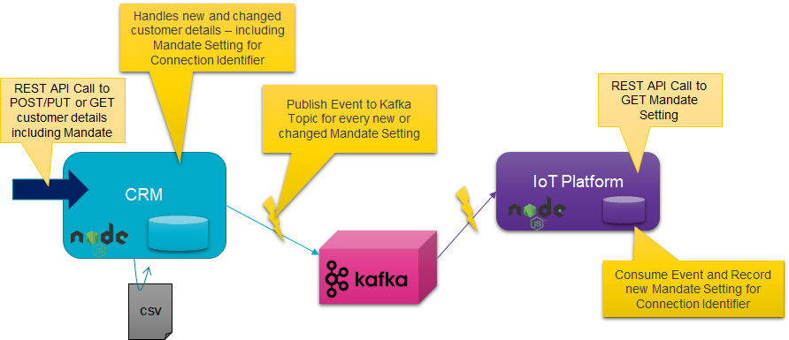
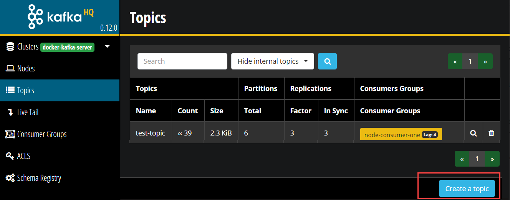
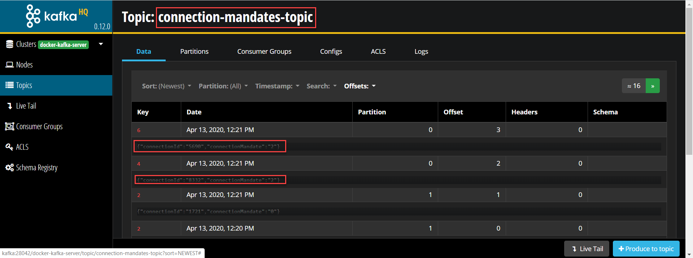

# Lab - DIY CQRS using Apache Kafka
In the previous lab, you have created Kafka client applications in Node. The applications produced to Kafka Topics and consumed messages from Kafka Topics. 

In this lab, we are going one step further to implement a fairly realistic use case. The context is a utility company. It is starting out with Smart Meters in the field and an IoT Platform to collect readings from those meters. In order to be allowed to collect readings from a meter associated with a connection (gas, heat or electricity), a customer needs to provide a mandate to the utility company. Such a mandate either grants permission to read with high frequency (semi real time) or to read once a month, only for the purpose of calculating the bill. If no mandate is issued by the customer, then no readings can be collected from the meter.

The connection mandates - along with all other information regarding customers, such as their address and contact details are managed by the CRM microservice. This service manages the state of customer related data. It handles REST API calls that provide new customer related data and it responds to REST API calls requesting data on customers. Note: we will not discuss security and GDPR related details at this point.

Part of the data managed by the CRM service is needed by the IoT Platform service. We want microservices to be as independent as possible. We do not want to have the successful operation of either service depend on the current availability of the other service. We do not even want services to know about other services if they do not really have to.

It has been decided therefore by the architects in this utility company that a new domain event has been identified: the Connection Mandate event that has a simple payload with just two fields: the connection identifier and the mandate level (0, 1 or 2 for no mandate, billing only or real-time reading). The team that owns the CRM service is instructed to publish the Connection Mandate event to a Kafka Topic - whenever the mandate settings for a customer change. The IoT Platform team is likewise advised to consume events from the same Kafka Topic and use these events to construct an actual overview of the mandate settings for all connections (gas, electricity or heat) they want to collect smart meter readings from.



In this lab, you will implement and run both microservices and the Kafka Topic that provides the decoupled bridge between the two.

Steps
* CRM Microservice to handle REST calls with data read and manipulation requests; the CRM Microservice loads initial data from a CSV file and it currently does not write any changes in the state of its data
* Create Kafka Topic for Connection Mandate settings 
* Extend CRM Microservice with publication of Connection Mandate messages to Kafka Topic
* IoT Platform Microservice that handles REST GET requests for the Mandate setting for a specific connection - initially without any Mandate data
* Extend IoT Platform Microservice with consumption of Connection Mandate messages from the corresponding Kafka Topic and use them to build the actual state of Connection Mandates
* Experiment with stopping and starting the IoT Platform Microservice and its ability to retain or regain its state 


## CRM Microservice 
Focus on the directory *CRM* in the lab folder. Here is where the CRM Service sources are.

The main service is defined in *app.js*. It uses the core Node *http* module that we have seen before. Using this module, it starts an HTTP Server, listening at PORT 3005 for GET and POST requests to read customer records or write new or modified customer records.

The *customers* object in *app.js* is the store of customers - the simple in-memory alternative to a real data store (such as NoSQL database or relational database or even an in-memory cache). We use the customer identifier as the key for storing and locating customers in this object.

When *app.js* is started, it runs function *importCustomers* from the *importer* module (file *importer.js*). This function reads the csv-file *customer-database.csv*, a simple comma separated values file with imaginary customer records. Each record read by *importCustomers* from this file is turned into a JavaScript object; the names of the properties of this object are taken from the field names in the header record in the CSV file. In the call to *importCustomers*, function reference is passed to a function that can handle customer objects. Using the *forEach* operator on the *customers* array, this function is invoked for each customer record that is read from the file.

Function *processCustomer* is defined in *app.js* and is passed to the *importCustomers* function. It adds new customer records to the *customers* collection of customers. For new customer records without identifier, it generates a new customer id value - with one added to the highest current customer identifier.  

Function *handleGetCustomer* is invoked to handle GET requests for retrieving customer information. The function can handle a request with a query parameter *customerId* to retrieve details for a single customer. A GET request with no query parameters return a full list - in JSON format - of all customers managed by the CRM service.  

Install the dependencies for the CRM service and run the service from the command line in the *lab3-diy-cqrs\CRM* directory:
```
npm install
npm start
```
On the console, you should see log output indicating that the CSV file is read and processed.

### Make HTTP Calls to the CRM Microservice
Using a tool such as Postman or tools like cURL or wget you can try to get in touch with the CRM Microservice. For example to request details on a customer with identifier 42, make the following call:
``` 
curl  http://localhost:3005?customerId=42 -v
```
You should find the console logging of the CRM service that the request was received, and you should see a response from it whose details are written to the command line by cURL. Defining appropriate status codes and messages go a long way in making the use of APIs a more pleasant experience. Try leaving out the customerId parameter; this should return a list of all customers.

Now try making a request for customer identifier with which real customer data is associated:
``` 
curl  http://localhost:3005?customerId=2 -v
```
To create a new customer, use this call with cURL:
```
curl POST http://localhost:3005/customers -H "Content-Type: application/json" -d '{    "firstName": "Molly",    "lastName": "Peterson",    "city": "Zeewolde",    "connectionId": "928",   "connectionMandate": "0"}' -v
```
On Windows, use the next call (Windows deals differently with ' and ""):
```
curl POST http://localhost:3005/customers -H "Content-Type: application/json" -d "{    \"firstName\": \"Molly\",    \"lastName\": \"Peterson\",    \"city\": \"Zeewolde\",    \"connectionId\": \"928\",   \"connectionMandate\": \"0\"}" -v
```
A new customer is created and the response to this request should indicate the newly assigned customer identifier. Of course you can subsequently GET the details for this new customer, by using that identifier.

## Create Kafka Topic for Connection Mandate settings 

The CRM Service is running and it is handling new customers as well as changes to existing customers. The next step to take is to make the CRM service inform the enterprise (IT landscape) of these customer related events. And the first step in realizing this requirement is the creation of a Kafka Topic onto which these events can be published.

Like you did in previous labs, open a terminal window on the Docker Host and run a `docker exec` command to start a shell in the `kafka-1` docker container 

```
docker exec -ti kafka-1 bash
```
Now let's create a new topic. For that we use the **kafka-topics** utility with the `--create` option. Create a *connection-mandates-topic* topic with 4 partitions and a replication factor of 2.  

```
kafka-topics --create --if-not-exists --zookeeper zookeeper-1:2181 --topic connection-mandates-topic --partitions 4 --replication-factor 2
```
Run this command to list the topics.

```
kafka-topics --list --zookeeper zookeeper-1:2181
```
You should see the new topic you have just created. 

Note: you can also create a new topic on the *Topics* page in AKHQ



## Extend CRM Microservice with event publication to connection-mandates-topic

Add this next line at the top of *app.js*; this imports module producer, defined in file *produce.js*. This module provides the bridge to the Kafka Topic.
``` 
const producer = require('./produce')
```
Note that the contents of *produce.js* is exactly the same as when we used this file in the lab on Node interaction with Apache Kafka. The configuration of the Kafka Cluster (the brokers) and the name of the topic is still in file *config.js*. Please make sure that the values in this value are correct for your environment.

Now whenever the CRM service registers a completely new customer, it should publish a message to the new *connection-mandates-topic* . And when for and existing customer anything changes in the values of connectionId or connectionMandate, then too should a message be published to the topic. 

The function that processes both new and changed customers is function *processCustomer* in *app.js*. It is from this function therefore that the function *producer.produceMessage* is to be invoked with a message payload that looks like this:
```
{ "connectionId":"4617", "connectionMandate" : "1" }
```
Add the following lines near the end of the function, just before the return statement:
```
    // check if the either the customer is new or the mandate settings has changed; in both cases: an event needs to be produced
    if (!oldCustomer || (oldCustomer.connectionId != customerObject.connectionId) || (oldCustomer.connectionMandate != customerObject.connectionMandate)) {
        producer.produceMessage(JSON.stringify({ "connectionId": customerObject.connectionId, "connectionMandate": customerObject.connectionMandate }))
    }
```
Run the application again. In the console output, there should be messages telling you about messages that are produced to the new Kafka Topic *connection-mandates-topic*.

When you register a new customer with the CRM service - a message will be published to the Kafka Topic as well. Try this out with this call with cURL:
```
curl POST http://localhost:3005/customers -H "Content-Type: application/json" -d '{    "firstName": "Molly",    "lastName": "Peterson",    "city": "Zeewolde",    "connectionId": "928",   "connectionMandate": "0"}' -v
```
On Windows, use the next call (Windows deals differently with ' and ""):
```
curl POST http://localhost:3005/customers -H "Content-Type: application/json" -d "{    \"firstName\": \"Molly\",    \"lastName\": \"Peterson\",    \"city\": \"Zeewolde\",    \"connectionId\": \"928\",   \"connectionMandate\": \"0\"}" -v
```
You can easily check the messages currently on the Kafka Topic in the Apache Kafka HQ GUI: http://kafka:28042/docker-kafka-server/topic/connection-mandates-topic .


## IoT Platform Microservice 
Let us turn our attention to the IoT Platform microservice in directory *IoTPlatform*. In real life, it would do many things However, for this lab we will focus on just one feature: it returns the connection mandate level (0, 1 or 2) for a given connection identifier, when asked in a simple HTTP GET Request. This feature is implemented in the Node application that has *app.js* as its core component.

Check the contents of *app.js*. You should be able by now to quickly recognize the HTTP Server that is started, listening at Port 3006. The server is configured to handle GET requests - and it only handle requests with a query parameter named *connectionId*.

It will check for an entry in the *connectionMandates* object. This object will initially be empty and in the current state of the application, it will always remain empty. There, any request at present will end up in a 404 HTTP response status: resource not found.

Install the dependencies for the IoT Platform microservice and run the service from the command line in the *lab3-diy-cqrs\IoTPlatform* directory:
```
npm install
npm start
```

Now try making a request for a connection identifier that exists in the *customer-database.csv* file - for which currently no mandate is known in the microservice:
``` 
curl  http://localhost:3006?connectionId=7733 -v
```
You will receive an HTTP 404 response status - as well you should. You may want to try a request with query parameter at all - just for kicks.

And now on to more serious business: consuming Connection Mandate messages into the IoT Platform microservice.

## Extend IoT Platform Microservice with consumption of Connection Mandate messages

When the IoT Platform microservice is started, we want it to register as a consumer on the Kafka topic *connection-mandates-topic*. We will use the familiar modules *consume.js* and *config.js*. The latter one contains the KAFKA_BROKERS endpoints and the KAFKA_TOPIC name. Please make sure that these are correct for your environment.

In order to get access to the module exported by *consume.js*, please add this line at the top of *app.js*:

```
const consumer = require('./consume')
```
Open file *consume.js*. Note the random value assigned to consumer group identifier; more about that later.  A new element is the variable *messageHandler*. This variable is used to store a reference to a function that this module should call whenever it consumers a message from the Kafka Topic. This variable is set through function *setMessageHandler* that is exported from the module and that - as we will see in a moment - is called from *app.js*.

Finally, take a look at function *initializeConsumer*. This function creates the Stream Reader on a topic and adds event handlers to the reader to handle messages as they are consumed. The *on data* event handler is triggered when a message is consumed; this handler invokes the function set in *messageHandler*.

Return to *app.js*. Add the following lines, just below the definition of `const connectionMandates`. 
```
const handleConnectionMandateMessage = function(message) {
    console.log(`Handling ConnectionMandate Message ${message.value.toString()} ` )
    let connectionMandate = JSON.parse(message.value.toString())
    connectionMandates[connectionMandate.connectionId]=connectionMandate
}
```
This defines a function that will handle any connectionMandate messages passed to it. We will tell the *consumer* that we want it to invoke this function whenever it consumes a message from the Kafka Topic.

The way to tell the *consumer* about our callback function is with a call to the setMessageHandler function, passing a reference to the function. Finally, to start the stream consumer on the Kafka Topic we have to invoke the *initialize* function on the consumer. Add the following two lines of code at the very end of *app.js*.
```
consumer.setMessageHandler(handleConnectionMandateMessage)
consumer.initializeConsumer();
```
Start the IoT Platform microservice again, using
```
npm start
```
What you should see happening now is that after a few seconds the HTTP Server reports for duty - listening on Port 3006. And shortly after that, the Kafka Stream Consumer is created and initialized and starts to consume messages - even though none are being published at the moment. Try to understand which messages are consumer when the microservice is started.

At this time, we can again attempt to retrieve the connect mandata status for a specific connection identifier:
``` 
curl  http://localhost:3006?connectionId=7733 -v
```
This time you should get a connection mandate setting. Its level is probably 1 - because that is how it is defined in the *customer-database.csv* file.

When you now change the connection mandate for this connection identifier, this change should rapidly be available in the IoT Platform service as well. Try this out with this call with cURL:
```
curl POST http://localhost:3005/customers/7 -H "Content-Type: application/json" -d '{    "firstName": "Corinne",    "lastName": "Lopez",    "city": "Enschede",    "connectionId": "7733",   "connectionMandate": "2"}' -v
```
On Windows, use the next call (Windows deals differently with ' and ""):
```
curl POST http://localhost:3005/customers/7 -H "Content-Type: application/json" -d "{    \"firstName\": \"Corinne\",    \"lastName\": \"Lopez\",    \"city\": \"Enschede\",    \"connectionId\": \"7733\",   \"connectionMandate\": \"2\"}" -v
```
This call updates the mandate level from 1 to 2. Now when you ask the IoT Platform service for the mandate level for connection identifier 7733, it should tell you the actual value of 2.

``` 
curl  http://localhost:3006?connectionId=7733 -v
```
Here we see more evidence of the fact that changes in connection mandates are reported from the CRM service and are absorbed by the IoT Platform service. And these two services know nothing about each other.  

## Experiment with stopping and starting the IoT Platform Microservice 

Stop the IoT Platform microservice.

Now start it again. From the logging, it is clear that - again- several messages are consumed. And when at this point you retrieve the mandate level once more for connection identifier 7733, it will be the level you set it at most recently: 2 (rather than 1 as defined in the CSV file)
``` 
curl  http://localhost:3006?connectionId=7733 -v
```
What you see here is quite important: the Kafka Topic has now become the single source of truth for the IoT Platform service. The data on the topic persists and provides the state for the microservice. The microservice can be stopped and started again and multiple instances of the microservice can run side by side (scale out or scale horizontally) and they will all have access to the same data.

Stop the IoT Platform service once more. Let's now update the mandate level for a different connection identifier - 4512 - from 0 to 2

```
curl POST http://localhost:3005/customers/5 -H "Content-Type: application/json" -d '{    "firstName": "Markus",    "lastName": "Berg",    "city": "Maassluis",    "connectionId": "4512",   "connectionMandate": "2"}' -v
```
On Windows, use the next call (Windows deals differently with ' and ""):
```
curl POST http://localhost:3005/customers/5 -H "Content-Type: application/json" -d "{    \"firstName\": \"Markus\",    \"lastName\": \"Berg\",    \"city\": \"Maassluis\",    \"connectionId\": \"4512\",   \"connectionMandate\": \"2\"}" -v
```
Verify the successful processing of this command, by inspecting the actual state of the customer record:
``` 
curl  http://localhost:3005?customerId=5 -v
```
Now start the IoT Platform service again. It was not up and running while we made the update to the the Markus Berg record. When we now ask the IoT Platform Service for the mandate level for Markus Berg, do we get the level specified in the customer-database.csv file (0) or the level it was set to through the CRM service when the IoT Platform service was not running?

``` 
curl  http://localhost:3006?connectionId=4512 -v
```
The result should be 2 - the level it was set to most recently. The message describing this update is the most recent message on the Kafka Topic and should be processed last when the IoT Platform service restarted. 

### Kafka as state store

Kafka can retain data for a very long time, and very much of it to. One reason for perhaps not using it indefinitely as the state store for the IoT Platform service is the rather long time it will start to take to read all data from the store into memory. The topic itself does not lend itself very well to querying, so it is really not an option to rely soley on Kafka for holding state.

The reason that the IoT Platform microservice reconsumes all data from the Kafka topic whenever it is started again is a combination of two things:
```
const kafkaConf = { "group.id": "iot-platform-consumer"+new Date().getTime()
...
const stream = new Kafka.KafkaConsumer.createReadStream(kafkaConf, { "auto.offset.reset": "earliest" }, {
...
```
1. The consumer group id is different on each instance of the IoT Platform microservice. Each instance will have a fresh offset into the Connection Mandates Topic.
2. The `offset.reset` is set to `earliest`. This means that the offset is set to oldest message on the topic

If you were to start the IoT Platform service in new terminal window, it would get hold of exactly the same connection mandate data as the first instance.

When you introduce a state store for the IoT Platform service - for example a NoSQL key-value store to persist the mapping between connection identifier and mandate level, shared between all instances of the microservice - you would immediately persist each Kafka message to the store. You would no longer have a need to always consume all messages on the Kafka topic from the earliest message on; in fact, that is emphatically what you would not want to do. At this point, you would change the *consumer group id* into a fixed value. Restarting the microservice would result in consuming only messages produced since the service last consumed a message from the topic as well as new messages.

### Restarting the CRM service

Now you may wonder what would happen if you restart the CRM service? Go ahead. Stop the CRM service and restart it, using `npm start` in the `lab3-diy-cqrs\CRM` directory.

Now retrieve the mandate setting for connection identifier 7733 - the one that was updated to 2 through the CRM service earlier on:

``` 
curl  http://localhost:3006?connectionId=7733 -v
```
What happened when you restarted the CRM service is that it reloaded the *customer-database.csv* file and produced messages for each of the records. In this file, the mandate level for the connection identifier is 1. The readjustment to 2 was published to the Kafka Topic but not written to the CSV file. It did not become a persistent part of the state of the CRM service. The message on the Kafka Topic stating the mandate level at 1 - produced as the CRM service was restarting - has overridden the earlier message on the topic that declared the mandate level for 7733 to be 2. 


