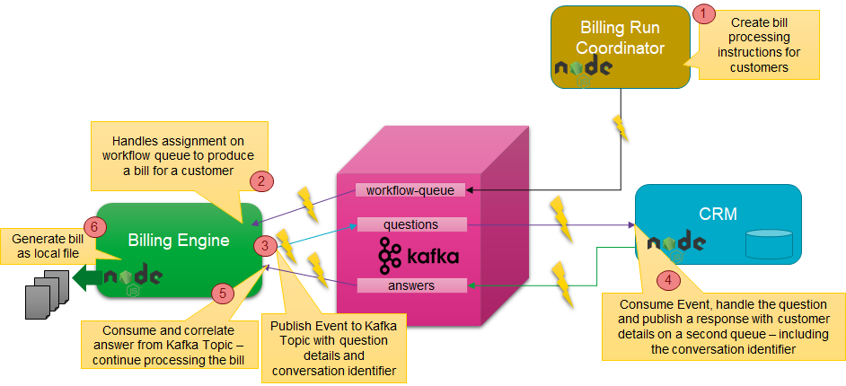
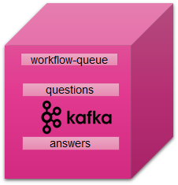
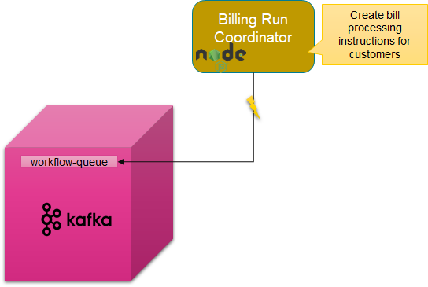
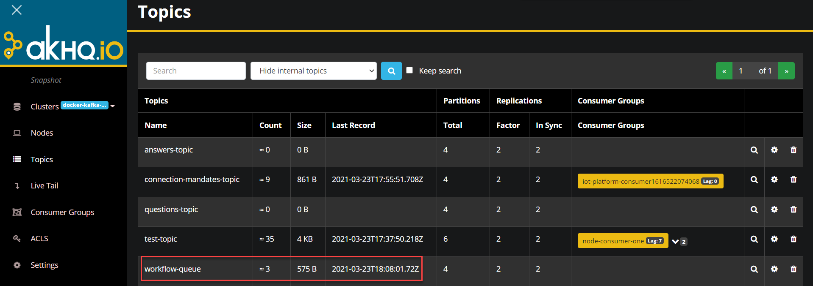
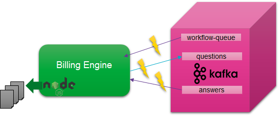
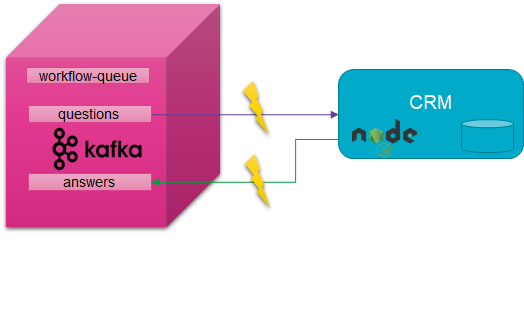
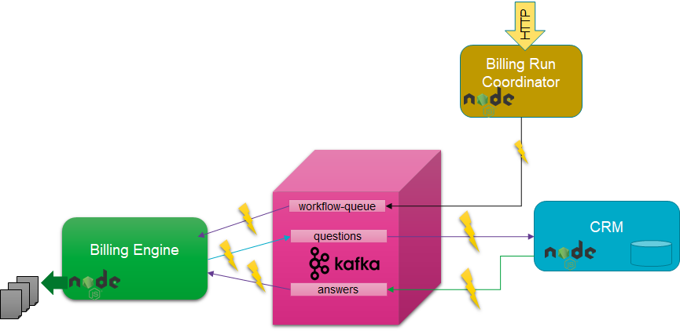

# Lab - Microservice Interaction
Microservices should be as autonomous as they can be. Ideally, they make no calls to other microservices, especially not  synchronous ones. They can stand alone when it comes to the data they need to do their jobs. In the previous lab we have looked at CQRS and locally maintaining derived state based on events published by other microservices. The only dependency for this, is a dependency on the highly available, highly scalable, distributed Kafka Cluster - and on the common definition of the message published on the topic.

In this lab we will look at the situation where a microservice needs to leverage the functionality offered by another service. It should still be as autonomous as possible: it should not need to know where the other microservice lives, how it was implemented, if it is even running at present. An agreement has been made on asynchronous communication via Kafka Topics: send a request through one topic and receive a correlated response in another topic. Without direct dependency - design or run time - many instances of the microservices involved can collaborate in a highly scalable, highly available fashion. 



The steps for implementing this scenario:
* create three Kafka Topics: workflow-queue, questions-topic and answers-topic
* create Billing Run Coordinator - a REST API invoked with one or more customer identifiers to order a bill to be produced for each customer
* create Billing Engine - a microservice that consumes bill-generate instructions in the form of messages from the workflow-queue, requests some customer details from the CRM Service - albeit in a very decoupled manner - and generates a bill in the form of a local file
* extend the CRM Service with the a feature to listen to the questions-topic, process a request and produce an answer

## Create Three Kafka Topics
Create three Kafka Topics: workflow-queue, questions-topic and answers-topic


Open a terminal window on the Docker Host and run a `docker exec` command to start a shell in the `kafka-1` docker container (or use Apache Kafka HQ to create the topics from the GUI)

```
docker exec -ti kafka-1 bash
```
Use the **kafka-topics** utility with the `--create` option to create the three topics: *workflow-queue*, *questions-topic* and *answers-topic*. Create the topics with a fairly arbitrary configuration with 4 partitions and a replication factor of 2.  

```
kafka-topics --create --if-not-exists --zookeeper zookeeper-1:2181 --topic workflow-queue --partitions 4 --replication-factor 2
kafka-topics --create --if-not-exists --zookeeper zookeeper-1:2181 --topic questions-topic --partitions 4 --replication-factor 2            
kafka-topics --create --if-not-exists --zookeeper zookeeper-1:2181 --topic answers-topic --partitions 4 --replication-factor 2            
```
Run this command to list the topics.

```
kafka-topics --list --zookeeper zookeeper-1:2181
```
You should see the new topics you have just created. 


## Billing Run Coordinator - Workflow Initiator
The Billing Run Coordinator is a simple Node application that exposes a REST API that can be invoked with one or more customer identifiers to order a bill to be produced for each customer. The application will not produce a bill itself. Instead, it will publish a message on the *workflow-queue* topic with an instruction to generate a bill for a specific customer. This message has the following simple payload:
```
{ "workflow-type": "bill-generation"
, "workflow-id" : "71638"
, "create-time" : "2020-04-15T14:24:11Z"
, "payload": { "customerIdentifier": "321"} 
}
```
The `workflow-type` specifies the type of workflow to be executed. The payload element contains whatever payload is relevant for the type of workflow. In this case, it contains the customer identifier.


Check out the file *app.js* in directory *billing-run-coordinator*. The code should look somewhat familiar by now:
* HTTP Server listening at port 3007
* POST request handler
* the body of the request is JSON parsed into a Javascript object (an array with customer identifier values)
* an imported *produce* module that connects to a Kafka Cluster and a KAFKA Topic defined in *configure,.js*  (*workflow-queue*)
* for each customer identifier, the *produceMessage* function is invoked with a workflow message to be produced to the *workflow-queue* topic

Before you can run the application, you need to install the npm dependencies, then start the npm application:
```
npm install

npm start 
```
You can now invoke the Billing Run Coordinator service - from Postman or using cURL from the command line. The following request instructs the Billing Run Coordinator to have bills generated for three customers:
```
curl POST http://localhost:3007 -H "Content-Type: application/json" -d '{"customerIdentifers":["2","4","5"]}' -v
```
On Windows, use the next call (Windows deals differently with ' and ""):

```
curl POST http://localhost:3007 -H "Content-Type: application/json" -d "{\"customerIdentifiers\": [\"2\",\"4\",\"5\"]}" -v
```
At this point, no bill is generated yet. No bill is in the process of being generated. The generator is not even available. But the instruction to prepare the bill have been safely persisted on the *workflow-queue*.



## Billing Engine Microservice - Workflow Step Execution Engine
The Billing Engine microservice will do the work of generating bills. It consumes bill-generation instructions in the form of messages from the workflow-queue, requests some customer details from the CRM Service - albeit in a very decoupled manner - and generates a bill in a local file.


There are some things different about this microservice. For starters, it does not expose REST API. The only interactions this service has are through Kafka Topics (consuming from two of them, producing to one topic) and the file system (generating bills to the local file system).

Open file *app.js*  in directory *billing-engine*. This is the main module in the Billing Engine service. It imports both a *consume* and a *produce* module. The latter is used for publishing *questions* of type *customer* on the *questions-topic*. The former consumes messages from two different topics - as configured in *config.js*: *answers-topic* and *workflow-queue*. 

In module *consume.js*, a Stream Consumer is created with subscriptions on two topics. The *on data* event handler inspects the topic from which the message is consumed. It then determines which *messageHandler* function to invoke to handle the message. The *messageHandlers* object is used as a key-value map that stores a reference to a message handling function - *value* - for the topic - *key*.

Back to *app.js*. Just before the consumer is initialized, two message handling functions are set for each of the two topics *workflow-queue* (function handleWorkflowAssignment) and *answers-topic* (function handleAnswer). 

Function *handleWorkflowAssignment* receives the workflow message that is consumed from the *workflow-queue* where it has been published by the *billing-run-coordinator* - although it could have been published by any message producer for all the *billing-engine* knows or cares. Only when the *workflow-type* is equal to *bill-generation* will the workflow be executed, by calling function *generateCustomerBill*. 

The workflow message contains an identifier; this identifier is used to identify the job that is created for generating the bill. A job object is created and stored in the key-value map *billGenerationJobs* - if it does not exist already. A question is then published to the *questions-topic* using the *producer.produceMessage* function. This question is of type *customer* and contains the *customerIdentifier* in its payload. At this point, the processing of this workflow instance is suspended. It will be resumed when an answer is received that belongs to this workflow instance.

Function *handleAnswer* is invoked when an answer message is received by the *consumer* on the *answers-topic*. The function checks if the *qaIdentifier* in the answer message corresponds to a *workflow identifier* for one of the workflow instances currently suspended in the *billGenerationJobs*. If it does not, processing of the answer is halted. If it does, the actual *answer* from the answer message is added to the workflow instance object (*billGenerationJob*). Subsequently, function *generateCustomerBill* is invoked again - this time to finish the job. In this simple workflow example, we do not need to wait for additional questions to be answered - and we can generate the bill. This is done in function *completeBill* that write the bill to a text file in the local directory.    

Let's now try this out.

Before you can run the application, you need to install the npm dependencies, then start the npm application:
```
npm install

npm start 
```
The application will start. It will connect to the Kafka Cluster for publishing purposes as well as subscribe two consumers on topics *workflow-queue* and *answers-topic*. It will consume the workflow instructions from the *workflow-queue* that were put on the queue from the *billing-run-coordinator* when you invoked that a little earlier on using *curl*.

The bills not actually get generated yet: the *billing engine* requires information about customers. And it is not supposed to invoke the *CRM service* directly, if for no other reason than that this service is not currently running. The *billing engine* is now waiting - for new workflow instructions on the *workflow-queue* and for answers on the *answers-topic*.


## CRM Microservice - Asynchronous Answering Machine
The *CRM microservice* in directory *CRM* is quite similar to the CRM service we worked with in the previous lab. However, it does not produce messages to the *connection-mandates-topic*. And it has been extended to listen for questions regarding customers on the *questions-topic* and to produce answers to such indirect requests to the *answers-topic*. 


File *app.js* - the main module in the application imports two modules: *producer* and *consumer*. These are quiet familiar by now - utility modules for producing to and consuming from Kafka topics. They leverage the Kafka configuration in *config.js* - the file you have seen before in these labs.

Around line 112, you will find function *handleQuestion*. This function is the message handler for messages consumed from *answers-topic*. It is configured as such in line 125, right before the consumer is initialized in the line 126.

*handleQuestion* checks if the *questionCategory* is *customer*, the only category this microservice is qualified to answer. If that is the case, function *answerQuestion* is invoked to actually produce the answer. This function prepares an answer object and produces it to the *answers-topic*. A crucial element in the answer object is the *qaIdentifier*. This is the correlation identifier - the value that identifies this question as well as the answer (to the question). The receiving party - microservice *Billing Engine* - will be able to associate the answer with the job instance for which the information is required. More plainly put: to generate a bill, the billing engine needs to know the customer details. The question contains the customer identifier and the answer's payload is the full *customer* object from the CRM service. 

Time to run the application. As always, first install the npm dependencies, then start the npm application:
```
npm install

npm start 
```
What happens now (as you can observe in the console output):
* CRM starts an HTTP server and listens at Port 3008 (for POST and GET requests, not really relevant to this lab)
* CRM subscribes to the *questions-topic*
* CRM connects to the Kafka Cluster for producing to the *answers-topic* 

Some questions were produced by the Billing Engine to the *questions-topic*. These should now be consumed and answered by the CRM service. Answers are published to the *answers-topic*.

This in turn will bring the *Billing Engine* back to life: it consumes the answers, correlates these with the pending jobs and completes those jobs. Files with the bills for three customers should now be generated into directory *billing-engine*.


## Trigger the Billing Run Workflow
With all services up and running, let's put all pieces together in one smooth end to end flow. 


Make a request to the Billing Run Coordinator for two customers. 
```
curl POST http://localhost:3007 -H "Content-Type: application/json" -d '{"customerIdentifers":["1","3"]}' -v
```
On Windows, use the next call (Windows deals differently with ' and ""):

```
curl POST http://localhost:3007 -H "Content-Type: application/json" -d "{\"customerIdentifiers\": [\"1\",\"3\"]}" -v
```

Then watch as the bills for these two customers are produced through asynchronous collaboration between three services that are unaware of each other. They can scale, crash & recover, relocate, reimplement in new technologies without impacting each other. 

If you stop the CRM Service or the Billing Engine, processing is interrupted. But nothing gets lost. As soon as you start up the service again, it continues processing. Kafka Topics are the persistent decoupling layer between the services. Note however that the Billing Engine currently has the state for pending Jobs in memory. If the engine is stopped while jobs are still pending, these job instances are lost. This can be remedied by storing these jobs in a backend store that survives service restarts.